```{r xaringan-themer, include = FALSE}
#install.packages('xaringan')
# install.packages("devtools")
#devtools::install_github("gadenbuie/xaringanthemer")
#install.packages('kableExtra')
#install.packages("rpart.plot")
#install.packages("rpart")
library(xaringanthemer)
library(xaringan)
mono_accent(
  base_color = "#43418A",
  header_font_google = google_font("Josefin Sans"),
  text_font_google   = google_font("Montserrat", "300", "300i"),
  code_font_google   = google_font("Droid Mono")
)
```
#Outline

####Ensemble Methods
--

####Bagging Methods

- RandomForest
--

####Boosting

- AdaBoosting

- Gradient Boosting

- xGM Boosting

---
class: inverse, center, middle

# Ensemble Models

---

# Statistical Learning Models

<br/>
<br/>

.center[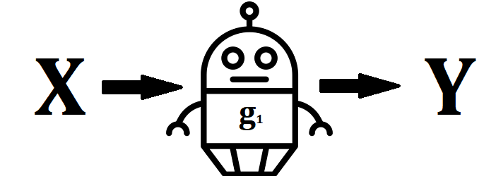]


---

# Ensemble Models


.center[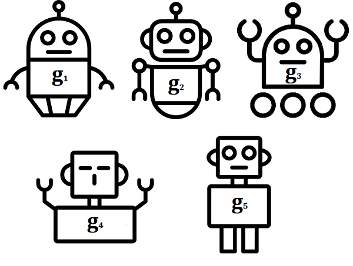]


---


# Ensemble Models

<br/>
<br/>

.center[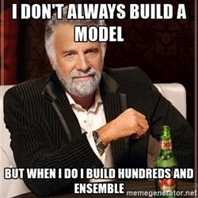]


---
# Ensemble Models

<br/>
<br/>

.center[]

---

class: inverse, center, middle

# Bagging

---

##.center[*Booststraping Aggregation*]

### Regression Problems
 $$\hat{G}_{bag}(\mathbf{x})=\frac{1}{B}\sum_{b=1}^{B}\hat{g}^{*b}(\mathbf{x})$$


### Classification Problems
 $$\hat{G}_{bag}(\mathbf{x})=sign\left(\sum_{b=1}^{B}\hat{g}^{*b}(\mathbf{x})\right)$$


---
# Bootstraping
.center[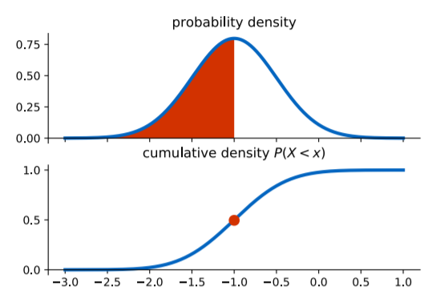]


---

# Bootstraping
.center[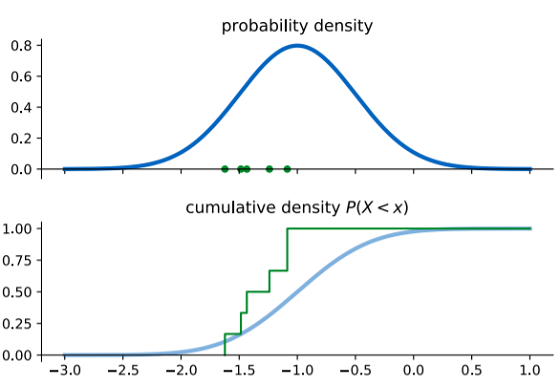]


---
# Bootstraping
.center[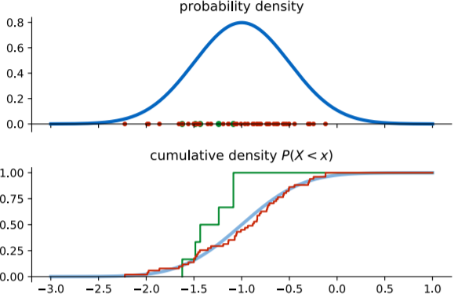]


---

# Bootstraping
.center[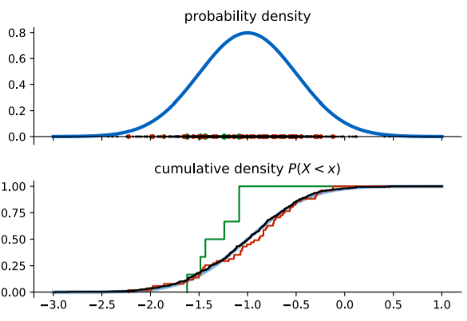]


---
# Bagging: Pseudo code

1. Sample, with replacement, a *k* dataset of the same size as the whole data set ( k bootstraping samples).

--

1. Train a models to each boostrap sample.

--
1. The ensemble prediction is given by:

   **the mean** from all predictions from models (for regression tasks)<br/>
   
   **the majority vote** among all models (for classification tasks)


---
background-image: url(forest.jpg)
background-size: cover
class: inverse, center, middle

# Random Forest

---
# Random Forest

-Bagging with decision trees

-Subsample the data *and* the features for each model in the ensemble

-Reduces variance, few hyperparameters, easy to paralellise.

-No reduction of bias

---
# Bias, variance and Ensemble

.center[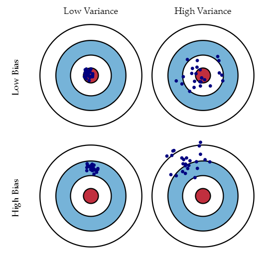]

---
background-image: url(code_time.gif)
background-size: cover
class: inverse, center, middle

# Code Time!

---

class: inverse, center, middle

# Boosting

---
# Boosting Models

-**Adaptative Boosting (Freund and Schapire,1999)**
<br/>
<br/>
--
- Gradient Boosting(Friedman, 2001)
<br/>
<br/>
--
-Stochastic Gradient Boosting (Friedman, 2002)
<br/>
<br/>
--
-eXtreme Gradient Boosting (Chen, et. al, 2016)
<br/>
<br/>
--
-LightBoosting (Ke, et. al, 2017)

---

class: inverse, center, middle

# Boosting Adaptativo
## (AdaBoosting)

---

# AdaBoosting

Dado $$\mathbf{y}\in\{1,1\}$$
<br/>
<br/>

$$G(\mathbf{x})=sign \left(\sum_{m=1}^{M} \alpha_{m}g_{m}(\mathbf{x}) \right)$$

--
<br/>
<br/>
##.center[The weighted wisdom of a crowd of experts]


---

# AdaBoosting

<br/>
<br/>

.center[]


---
background-image: url(macaco_fazendo_conta.gif)
background-size: cover
class: center, middle, inverse

# Algebra Time!

---

#AdaBoosting

```{r message=FALSE, warning=FALSE, eval=require('tidyverse'), echo=FALSE}
library(magrittr)
library(kableExtra)

medical_care<-data.frame(Chest_Pain=c("Yes","No","Yes","Yes","No","No","Yes","Yes"),
                         Blocked_Arteries=c("Yes","Yes","No","Yes","Yes","Yes","No","Yes"),
                         Patient_Weight=c(205,180,210,167,156,125,168,172),
                         Heart_Disease=c("Yes","Yes","Yes","Yes","No","No","No","No"))

knitr::kable(medical_care,format='html',align = 'c') %>% 
        kable_styling(bootstrap_options = "striped", full_width = F) %>% 
        column_spec(4, bold = T,color='#243B4A')

```


---
#AdaBoosting

```{r message=FALSE, warning=FALSE, eval=require('tidyverse'), echo=FALSE}
library(magrittr)
library(kableExtra)

medical_care<-medical_care %>% 
              mutate(Weights=round(1/nrow(medical_care),3))
               

knitr::kable(medical_care,format='html',align = 'c') %>% 
        kable_styling(bootstrap_options = "striped", full_width = F) %>% 
        column_spec(4, bold = T,color='#243B4A')

```

---

# AdaBoost

```{r message=FALSE,fig.align='center', warning=FALSE, eval=require('tidyverse'),fig.width=4,fig.height=4, echo=TRUE}
library(rpart)
library(rpart.plot)
g1<-rpart(Heart_Disease~Chest_Pain+Blocked_Arteries+Patient_Weight,
             data=medical_care,
             control = rpart.control(maxdepth=1,minsplit = 2))
               
rpart.plot(g1)

```

---

#AdaBoosting
```{r message=FALSE,fig.align='center', warning=FALSE, eval=require('tidyverse'),fig.width=4,fig.height=4, echo=FALSE}
library(rpart)
library(magrittr)
library(kableExtra)
pred<-predict(g1,newdata = medical_care,type='class')

medical_care<-medical_care %>% 
            select(-Weights) %>% 
            mutate(g1=cell_spec(pred,'html',color=ifelse(pred==Heart_Disease,"green","red")))

knitr::kable(medical_care,format='html',align = 'c',escape=F) %>% 
        kable_styling(bootstrap_options = "striped", full_width = F) %>% 
        column_spec(4:5, bold = T,color='#243B4A') 

```
--
$$\alpha_{1}=\frac{1}{2}log\left(\frac{1-\epsilon_{1}}{\epsilon_{1}} \right)$$
--
$$\alpha_{1}=\frac{1}{2}log\left(\frac{1-\epsilon_{1}}{\epsilon_{1}} \right)=\frac{1}{2}log\left(\frac{1-0.125}{0.125} \right)=0.973$$

---

#Voting Power

$$\alpha_{1}=\frac{1}{2}log\left(\frac{1-\epsilon_{1}}{\epsilon_{1}} \right)$$

```{r echo=FALSE,fig.align='center',fig.width=6,fig.height=6}
curve(0.5*log((1-x)/x),0,1,xlab="Accuracy",ylab=expression(alpha),lwd=3,col='blue')
title("Majority Vote")
```
---
#AdaBoosting
```{r message=FALSE,fig.align='center', warning=FALSE, eval=require('tidyverse'),fig.width=4,fig.height=4, echo=FALSE}
library(rpart)
library(magrittr)
library(kableExtra)
pred<-predict(g1,newdata = medical_care,type='class')

medical_care<-medical_care %>% 
            mutate(New_Weights= " ")

knitr::kable(medical_care,format='html',align = 'c',escape=F) %>% 
        kable_styling(bootstrap_options = "striped", full_width = F) %>% 
        column_spec(4:5, bold = T,color='#243B4A') 

```
--

$$New\;weights_{correct}=weights_{correct}\times e^{-\alpha_{1}}$$
--
$$New\;weights_{correct}=0.125\times e^{-0.973}=0.047$$
---
#AdaBoosting
```{r message=FALSE,fig.align='center', warning=FALSE, eval=require('tidyverse'),fig.width=4,fig.height=4, echo=FALSE}
library(rpart)
library(magrittr)
library(kableExtra)
#pred<-predict(g1,newdata = medical_care,type='class')

medical_care<-medical_care %>% 
            mutate(New_Weights=c(0.047,0.047,0.047," ",0.047,0.047,0.047,0.047))

knitr::kable(medical_care,format='html',align = 'c',escape=F) %>% 
        kable_styling(bootstrap_options = "striped", full_width = F) %>% 
        column_spec(4:5, bold = T,color='#243B4A') 

```
$$New\;weights_{correct}=weights_{correct}\times e^{-\alpha_{1}}$$

$$New\;weights_{correct}=0.125\times e^{-0.973}=0.047$$
---

#Weighting Correct


```{r echo=FALSE,fig.align='center',fig.width=7,fig.height=7}
curve(exp(-x),0,3.5,xlab=expression(alpha),ylab="",lwd=3,col='blue')
```
---


#AdaBoosting
```{r message=FALSE,fig.align='center', warning=FALSE, eval=require('tidyverse'),fig.width=4,fig.height=4, echo=FALSE}
knitr::kable(medical_care,format='html',align = 'c',escape=F) %>% 
        kable_styling(bootstrap_options = "striped", full_width = F) %>% 
        column_spec(4:5, bold = T,color='#243B4A') 
```
--
$$New\;weights_{wrong}=weights_{wrong}\times e^{\alpha_{1}}$$
--
$$New\;weights_{wrong}=0.125\times e^{0.973}=0.331$$
---
#AdaBoosting
```{r message=FALSE,fig.align='center', warning=FALSE, eval=require('tidyverse'),fig.width=4,fig.height=4, echo=FALSE}
library(rpart)
library(magrittr)
library(kableExtra)
#pred<-predict(g1,newdata = medical_care,type='class')

medical_care<-medical_care %>% 
            mutate(New_Weights=c(0.047,0.047,0.047,0.331,0.047,0.047,0.047,0.047))

knitr::kable(medical_care,format='html',align = 'c',escape=F) %>% 
        kable_styling(bootstrap_options = "striped", full_width = F) %>% 
        column_spec(4:5, bold = T,color='#243B4A') 

```

$$New\;weights_{wrong}=weights_{wrong}\times e^{\alpha_{1}}$$

$$New\;weights_{wrong}=0.125\times e^{0.973}=0.331$$

---
#Weighting Wrong

```{r echo=FALSE,fig.align='center',fig.width=7,fig.height=7}
curve(exp(x),0,3.5,xlab=expression(alpha),ylab="",lwd=3,col='blue')
```
---
#AdaBoosting

```{r message=FALSE,fig.align='center', warning=FALSE, eval=require('tidyverse'),fig.width=4,fig.height=4, echo=FALSE}
knitr::kable(medical_care,format='html',align = 'c',escape=F) %>% 
        kable_styling(bootstrap_options = "striped", full_width = F) %>% 
        column_spec(4:5, bold = T,color='#243B4A') 

```

---

#AdaBoosting
```{r message=FALSE,fig.align='center', warning=FALSE, eval=require('tidyverse'),fig.width=4,fig.height=4, echo=FALSE}
library(rpart)
library(magrittr)
library(kableExtra)
#pred<-predict(g1,newdata = medical_care,type='class')

medical_care<-medical_care %>% 
            mutate(New_Weights=c(0.071, 0.071, 0.071, 0.502, 0.071, 0.071, 0.071, 0.071)) %>% 
            rename(Norm_Weights=New_Weights)

knitr::kable(medical_care,format='html',align = 'c',escape=F) %>% 
        kable_styling(bootstrap_options = "striped", full_width = F) %>% 
        column_spec(4:5, bold = T,color='#243B4A') 

```


---

#AdaBoosting


```{r,echo=FALSE}
set.seed(4)
reweighted_data<-medical_care[sample(1:nrow(medical_care),nrow(medical_care),
                                     replace = TRUE,
                                     prob = medical_care$Norm_Weights),]

reweighted_data %>% select(Chest_Pain,Blocked_Arteries,Patient_Weight,Heart_Disease) %>% 
knitr::kable(format='html',align = 'c',escape=F,row.names = FALSE) %>% 
        kable_styling(bootstrap_options = "striped", full_width = F) %>% 
        column_spec(4, bold = T,color='#243B4A') 


```

---
#AdaBoosting
```{r,echo=FALSE}

reweighted_data %>% select(Chest_Pain,Blocked_Arteries,Patient_Weight,Heart_Disease) %>% 
knitr::kable(format='html',align = 'c',escape=F,row.names = FALSE) %>% 
        kable_styling(bootstrap_options = "striped", full_width = F) %>% 
        column_spec(4, bold = T,color='#243B4A') %>% 
        row_spec(c(2:4,6), bold = T, color = "white", background = "#3454D1")


```
---


# AdaBoosting

```{r message=FALSE,fig.align='center', warning=FALSE, eval=require('tidyverse'),fig.width=4,fig.height=4, echo=TRUE}
g2<-rpart(Heart_Disease~Chest_Pain+Blocked_Arteries+Patient_Weight,
             data=reweighted_data,
             control = rpart.control(maxdepth=1,minsplit = 2))
               
rpart.plot(g2)
```
---

#AdaBoosting
```{r message=FALSE,fig.align='center', warning=FALSE, eval=require('tidyverse'),fig.width=4,fig.height=4, echo=FALSE}
library(rpart)
library(magrittr)
library(kableExtra)
pred<-predict(g2,newdata = reweighted_data,type='class')

reweighted_data<-reweighted_data %>% 
            select(-c(g1,Norm_Weights)) %>% 
            mutate(g2=cell_spec(pred,'html',color=ifelse(pred==Heart_Disease,"green","red")))

knitr::kable(reweighted_data,format='html',align = 'c',escape=F) %>% 
        kable_styling(bootstrap_options = "striped", full_width = F) %>% 
        column_spec(4:5, bold = T,color='#243B4A') 

```
--
$$\alpha_{2}=\frac{1}{2}log\left(\frac{1-\epsilon_{2}}{\epsilon_{2}} \right)$$
--
$$\alpha_{2}=\frac{1}{2}log\left(\frac{1-\epsilon_{1}}{\epsilon_{1}} \right)=\frac{1}{2}log\left(\frac{1-0.25}{0.25} \right)=0.549$$

---

#AdaBoosting

<br/>
<br/>
$$G(\mathbf{x})=sign \left(\sum_{m=1}^{M} \alpha_{m}g_{m}(\mathbf{x}) \right)$$
--
<br/>
<br/>
$$G(\mathbf{x_{i}})=sign \left(\alpha_{1}g_{1}(\mathbf{x}_{i})+\alpha_{2}g_{2}(\mathbf{x}_{i})+\dots+ \alpha_{M}g_{M}(\mathbf{x_{i}}) \right)$$
--
<br/>
<br/>
$$G(\mathbf{x_{i}})=sign \left(1\times(\alpha_{1,Sim}+\dots+\alpha_{k,Sim})+(-1)\times \right(\alpha_{2,Não}+\dots+\alpha_{p,Não}))$$

---

class: inverse, center, middle

# Dados Simulados


---
# Dados Simulados
.center[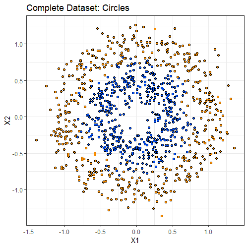]

---
# Dados Simulados
.center[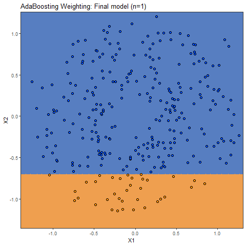]

---
# Dados Simulados
.center[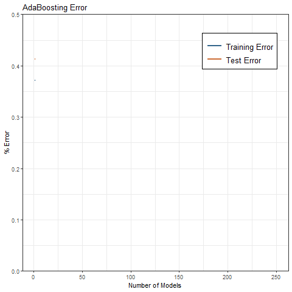]

---
class: center, middle, inverse

# Gradient Boosting

---

# Gradient Boosting

Find the the function $\hat{g}$ which minimizes the loss function

# $$L(\mathbf{\hat{G},y})=\sum_{n=1}^{N} L(y_{i},\hat{G}(x_{i}))$$


---
## Gradient Descent

One of the simplest optimization algorithms is called gradient descent or steepest descent. This can be written as follows, given a function of $f(\mathbf{\theta})$, the value of $\theta$ that minimizes $f$ can be given by
--
<br/>
<br/>

$$\boldsymbol{\theta_{k+1}}=\boldsymbol{\theta_{k}}-\eta_{k}\mathbf{g_{k}}=\boldsymbol{\theta_{k}}-\eta_{k}\nabla_{\theta}f(\boldsymbol{\theta_{k}})$$
--

.center[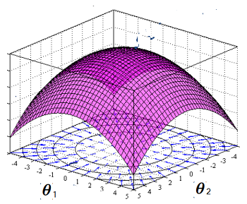]

---

# Gradient Boosting

Adapting the gradient descent solution to the loss function, we have that the $\mathbf{\hat{G}}$ which minimizes the loss function can be given by

# $$\mathbf{\hat{G}}_{m+1}=\mathbf{\hat{G}}_{m}-\eta_{m}\mathbf{g_{m}}$$

--

where

## $$g_{im}=\left[ \frac{\partial L(y_{i},G(x_{i}))}{\partial G(x_{i})} \right]\Big|_{G(x_{i})=G_{m}(x_{i})}$$
---
#Gradient Boosting vs. AdaBoost

.pull-left[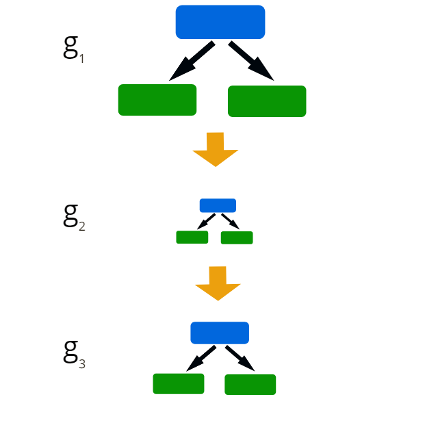]

.pull-right[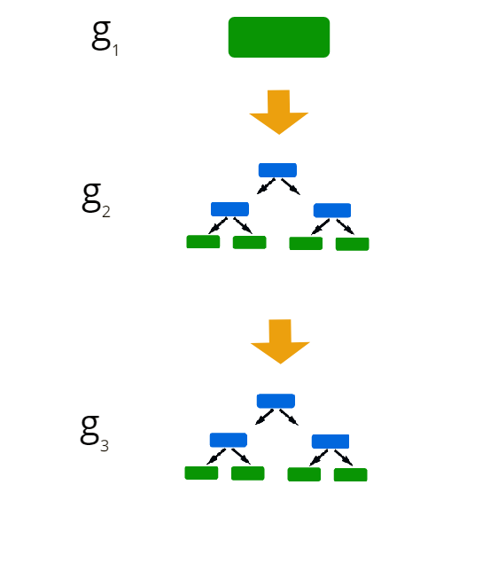]
---

class: inverse, center, middle

# Regression Gradient Boosting

---
# Gradient Boosting Regression

```{r message=FALSE, warning=FALSE, eval=require('tidyverse'), echo=FALSE}
library(magrittr)
library(kableExtra)

grad_weight<-data.frame(Height=c(1.6,1.6,1.5,1.8,1.5,1.4),
                         Favorite_Colour=c("Blue","Green","Blue","Red","Green","Blue"),
                         Gender=c("Male","Female","Female","Male","Male","Female"),
                         Weight=c(88,76,56,73,77,57))

knitr::kable(grad_weight,format='html',align = 'c') %>% 
        kable_styling(bootstrap_options = "striped", full_width = F) %>% 
        column_spec(4, bold = T,color='#243B4A')

```

---
## First Round

```{r message=FALSE, warning=FALSE, eval=require('tidyverse'), echo=FALSE}
library(magrittr)
library(kableExtra)

grad_weight<-grad_weight %>% 
            mutate(G_0=round(mean(Weight),2))

knitr::kable(grad_weight,format='html',align = 'c') %>% 
        kable_styling(bootstrap_options = "striped", full_width = F) %>% 
        column_spec(4:5, bold = T,color='#243B4A')

```

---

## First Round

```{r message=FALSE, warning=FALSE, eval=require('tidyverse'), echo=FALSE}
library(magrittr)
library(kableExtra)

grad_weight<-grad_weight %>% 
            mutate(Pseudo_Residuals=Weight-G_0)

knitr::kable(grad_weight,format='html',align = 'c') %>% 
        kable_styling(bootstrap_options = "striped", full_width = F) %>% 
        column_spec(6, bold = T,color='#243B4A')

```


---
## Tree Pseudo Residuals Model

```{r message=FALSE,fig.align='center', warning=FALSE, eval=require('tidyverse'),fig.width=4,fig.height=4, echo=TRUE}
library(rpart)
library(rpart.plot)
g0<-rpart(Pseudo_Residuals~Height+Favorite_Colour+Gender,
             data=grad_weight,
             control = rpart.control(maxdepth=2,minsplit = 2))
               
rpart.plot(g0)


```

---
## First Round

```{r message=FALSE, warning=FALSE, eval=require('tidyverse'), echo=FALSE}
library(magrittr)
library(kableExtra)

grad_weight<-grad_weight %>% 
            mutate(g_0=predict(g0,newdata =grad_weight ))

knitr::kable(grad_weight,format='html',align = 'c') %>% 
        kable_styling(bootstrap_options = "striped", full_width = F) %>% 
        column_spec(7, bold = T,color='#243B4A')

```


---
## First Round

```{r message=FALSE, warning=FALSE, eval=require('tidyverse'), echo=FALSE}
library(magrittr)
library(kableExtra)

grad_weight<-grad_weight %>% 
            mutate(G_1=G_0+0.1*g_0)

knitr::kable(grad_weight,format='html',align = 'c') %>% 
        kable_styling(bootstrap_options = "striped", full_width = F) %>% 
        column_spec(8, bold = T,color='#243B4A')

```


---
## Second Round
```{r message=FALSE, warning=FALSE, eval=require('tidyverse'), echo=FALSE}
library(magrittr)
library(kableExtra)

new_grad_weight<-select(grad_weight,c("Height","Favorite_Colour","Gender","Weight","G_1"))

knitr::kable(new_grad_weight,format='html',align = 'c') %>% 
        kable_styling(bootstrap_options = "striped", full_width = F) %>% 
        column_spec(4, bold = T,color='#243B4A')

```
---
## Second Round

```{r message=FALSE, warning=FALSE, eval=require('tidyverse'), echo=FALSE}
library(magrittr)
library(kableExtra)

new_grad_weight<-new_grad_weight %>% 
            mutate(Pseudo_Residuals=Weight-G_1)

knitr::kable(new_grad_weight,format='html',align = 'c') %>% 
        kable_styling(bootstrap_options = "striped", full_width = F) %>% 
        column_spec(6, bold = T,color='#243B4A')

```
---
## Tree Pseudo Residuals Model

```{r message=FALSE,fig.align='center', warning=FALSE, eval=require('tidyverse'),fig.width=4,fig.height=4, echo=TRUE}
library(rpart)
library(rpart.plot)
g1<-rpart(Pseudo_Residuals~Height+Favorite_Colour+Gender,
             data=new_grad_weight,
             control = rpart.control(maxdepth=2,minsplit = 2))
               
rpart.plot(g1)


```

---
## Second Round

```{r message=FALSE, warning=FALSE, eval=require('tidyverse'), echo=FALSE}
library(magrittr)
library(kableExtra)

new_grad_weight<-new_grad_weight %>% 
            mutate(g_1=predict(g1,newdata=new_grad_weight))

knitr::kable(new_grad_weight,format='html',align = 'c') %>% 
        kable_styling(bootstrap_options = "striped", full_width = F) %>% 
        column_spec(7, bold = T,color='#243B4A')

```
---

## Second Round

```{r message=FALSE, warning=FALSE, eval=require('tidyverse'), echo=FALSE}
library(magrittr)
library(kableExtra)

new_grad_weight<-new_grad_weight %>% 
            mutate(G_2=round(G_1+0.1*g_1,2))

knitr::kable(new_grad_weight,format='html',align = 'c') %>% 
        kable_styling(bootstrap_options = "striped", full_width = F) %>% 
        column_spec(8, bold = T,color='#243B4A')

```
---
#Pseudo Code
__Input__: Data $\{(x_{i},y_{i})\}_{i=1}^{n}$, and a differentiable __Loss Function__ $L(y_{i},G(x))$

--
__Step 1__: Initialize model with a constant values: $F_{0}(x)=\underset{\gamma}{argmin} \sum_{i}^NL(y_{i},\gamma)$

--
__Step 2__: for $m=1$ to $M$

  $\hspace{1cm}$__(a)__ Compute $r_{im}=-\left[ \frac{\partial L(y_{i},G(x_{i}))}{\partial G(x_{i})} \right]\Big|_{G(x_{i})=G_{m}(x_{i})}$ for $i=1,..,n$
  
  $\hspace{1cm}$__(b)__ Fit a regression tree to the $r_{im}$ values and create terminal regions $R_{jm}$,for $j=1,...,m$
  
  $\hspace{1cm}$__(c)__ For $j=1,\dots,J_{m}$ comp. $\gamma_{i,j}=\sum_{x_{i} \in R_{ij}}\underset{\gamma}{argmin} L(y_{i},G_{m-1}(x_{i})+\gamma)$
  
  $\hspace{1cm}$__(d)__ Update $G_{m}(\mathbf{x})=G_{m-1}(\mathbf{x}) +\eta \sum_{j=1}^{J_m} \gamma_{jm} I(x \in R_{jm})$
  
--

__Step 3__: Output $G_{M}(x)$
---

class: inverse, center, middle

# Classification Gradient Boosting

---
## Gradient Boosting Classification

```{r message=FALSE, warning=FALSE, eval=require('tidyverse'), echo=FALSE}
library(magrittr)
library(kableExtra)

grad_trolls<-data.frame(Likes_Popcorn=c("Yes","Yes","No","Yes","No","No"),
                         Age=c(12,87,44,19,32,14),
                         Favorite_Color=c("Blue","Green","Blue","Red","Green","Blue"),
                         Loves_Trolls_2=c("Yes","Yes","No","No","Yes","Yes"))

knitr::kable(grad_trolls,format='html',align = 'c') %>% 
        kable_styling(bootstrap_options = "striped", full_width = F) %>% 
        column_spec(4, bold = T,color='#243B4A')

```

Calculate the log of odds

$$log(odds)=log\left(\frac{4}{2}\right)=0.7$$

Probability of __Loving Trolls 2__= $\frac{e^{log(odds)}}{1+e^{log(odds)}}=0.7$

---
## Gradient Boosting Classifiation

```{r message=FALSE, warning=FALSE, eval=require('tidyverse'), echo=FALSE}
library(magrittr)
library(kableExtra)

grad_trolls<-grad_trolls %>% 
            mutate(G_0=0.7)

knitr::kable(grad_trolls,format='html',align = 'c') %>% 
        kable_styling(bootstrap_options = "striped", full_width = F) %>% 
        column_spec(5, bold = T,color='#243B4A')

```
---
# Gradient Boosting Regression

```{r message=FALSE, warning=FALSE, eval=require('tidyverse'), echo=FALSE}
library(magrittr)
library(kableExtra)

grad_trolls<-grad_trolls %>% 
               mutate(Residuals=ifelse(Loves_Trolls_2=="Yes",0.3,-0.7))

knitr::kable(grad_trolls,format='html',align = 'c') %>% 
        kable_styling(bootstrap_options = "striped", full_width = F) %>% 
        column_spec(6, bold = T,color='#243B4A')

```

---
## Modeling Tree Residuals
```{r message=FALSE,fig.align='center', warning=FALSE, eval=require('tidyverse'),fig.width=4,fig.height=4, echo=TRUE}
library(rpart)
library(rpart.plot)
g0<-rpart(Residuals~Likes_Popcorn+Age+Favorite_Color,
             data=grad_trolls,
             control = rpart.control(maxdepth=2,minsplit = 2))
               
rpart.plot(g0)


```
--
$$\frac{\sum Residuals_{i}}{\sum Previous Probability_{i}\times(1-Previous Probability_{i})}$$

---
## Gradient Boosting Classification

```{r message=FALSE, warning=FALSE, eval=require('tidyverse'), echo=FALSE}
library(magrittr)
library(kableExtra)

grad_trolls<-grad_trolls %>% 
            mutate(g_0=c(1.4,-1,-1,-3.3,1.4,1.4))

knitr::kable(grad_trolls,format='html',align = 'c') %>% 
        kable_styling(bootstrap_options = "striped", full_width = F) %>% 
        column_spec(7, bold = T,color='#243B4A')

```
--


The new predict loggods wil be given by

$$G_{1}=G_{0}+\eta*g_{0}$$

---
## Gradient Boosting Clasification

Considering $\eta$ = 0.8

```{r message=FALSE, warning=FALSE, eval=require('tidyverse'), echo=FALSE}
library(magrittr)
library(kableExtra)

grad_trolls<-grad_trolls %>% 
            mutate(G_1=G_0+0.8*g_0)

knitr::kable(grad_trolls,format='html',align = 'c') %>% 
        kable_styling(bootstrap_options = "striped", full_width = F) %>% 
        column_spec(8, bold = T,color='#243B4A')

```
--


The new probabilities will be given by loggods wil be given by


$Prob_{new1}=\frac{e^{log(odds)}}{1+e^{log(odds)}}=\frac{e^{G_1}}{1+e^{G_{1}}}$

---
## Gradient Boosting Clasification


```{r message=FALSE, warning=FALSE, eval=require('tidyverse'), echo=FALSE}
library(magrittr)
library(kableExtra)

grad_trolls<-grad_trolls %>% 
              mutate(New_Probs=round(exp(G_1)/(1+exp(G_1)),2)) %>% 
              select(Likes_Popcorn,Age,Favorite_Color,Loves_Trolls_2,New_Probs)
  


knitr::kable(grad_trolls,format='html',align = 'c') %>% 
        kable_styling(bootstrap_options = "striped", full_width = F) %>% 
        column_spec(5, bold = T,color='#243B4A')

```
---

#Pseudo Code
__Input__: Data $\{(x_{i},y_{i})\}_{i=1}^{n}$, and a differentiable __Loss Function__ $L(y_{i},G(x))$

--
__Step 1__: Initialize model with a constant values: $F_{0}(x)=\underset{\gamma}{argmin} \sum_{i}^NL(y_{i},\gamma)$

--
__Step 2__: for $m=1$ to $M$

  $\hspace{1cm}$__(a)__ Compute $r_{im}=-\left[ \frac{\partial L(y_{i},G(x_{i}))}{\partial G(x_{i})} \right]\Big|_{G(x_{i})=G_{m}(x_{i})}$ for $i=1,..,n$
  
  $\hspace{1cm}$__(b)__ Fit a regression tree to the $r_{im}$ values and create terminal regions $R_{jm}$,for $j=1,...,m$
  
  $\hspace{1cm}$__(c)__ For $j=1,\dots,J_{m}$ comp. $\gamma_{i,j}=\sum_{x_{i} \in R_{ij}}\underset{\gamma}{argmin} L(y_{i},G_{m-1}(x_{i})+\gamma)$
  
  $\hspace{1cm}$__(d)__ Update $G_{m}(\mathbf{x})=G_{m-1}(\mathbf{x}) +\eta \sum_{j=1}^{J_m} \gamma_{jm} I(x \in R_{jm})$
  
--

__Step 3__: Output $G_{M}(x)$
---
background-image: url(code_time.gif)
background-size: cover
class: inverse, center, middle

# Code Time!

---
background-image: url(mind_blow.gif)
background-size: cover
class: inverse, center, middle

# XGBoost: A scalable Tree Boosting System

---

#The Competitions Winner
<br/>
<br/>
<br/>
<br/>
<br/>

####.center[Among the 29 challenge winning solutions 3 published at Kaggle’s blog during 2015, 17 solutions used XGBoost]
---

# The objective function

$$Obj^{m}=\sum_{i=1}^{N}L(y_{i},\hat{G}^{(t)}(x_{i}))+\sum_{i=1}^{m}\Omega(g_{i})$$

where 
$$\Omega(g)=\gamma T+\frac{1}{2} \lambda ||w||^{2}$$

and $T$ is the __number of leafes__ in each tree and $w$ is the score from each leaf., $\lambda$ is the regularization parameter.

- Now the optimal score to each leaf is given by

$$w^{*}_{j}=- \frac{\sum_{i \in I_{j}}g_{i}}{\sum_{i \in I{j}}h_{i}+\lambda}$$
 
---
## How find the good structure for the tree


The gain of split is


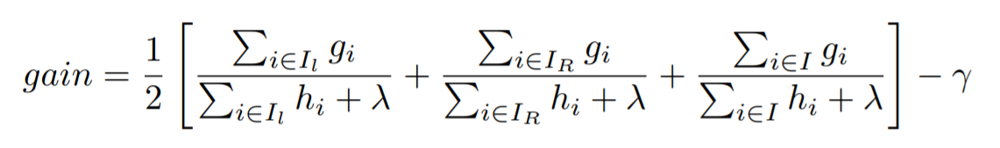
---

## Others majors contibutions from the XGBoost

- Designed and build a highly scalable end-to-end tree
boosting system.

- Proposed a theoretically justified weighted quantile
sketch for efficient proposal calculation (Find better and faster candidate splits).


- Introduced a novel sparsity-aware algorithm for parallel tree learning.


---
background-size: cover
class: inverse, center, middle

# XGBoost: Study Case 

---
class: center, middle,inverse

# Questions?

mateusmaia11@gmail.com

<br/>
<br/>

To learn more with XGBoosting

xgboost.readthedocs.io/en/latest/build.html

To explore more the AdaBoosting

mateusmaia.shinyapps.io/adaboosting/

Know the Laboratory in which I participate

led.ufba.br